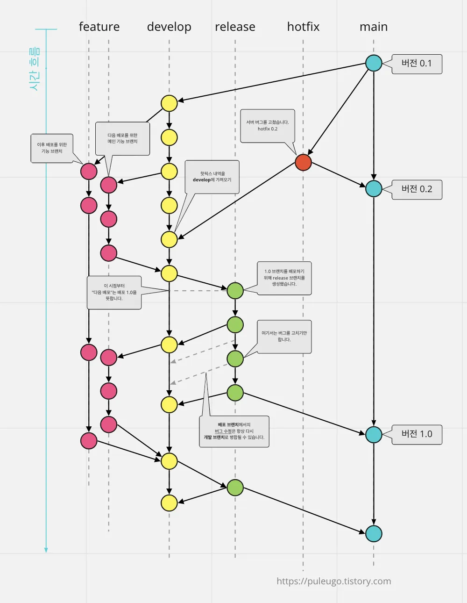

# 02. Git Flow: 브랜치 전략으로 체계적 협업

Git Flow는 다음 브랜치로 협업을 구조화합니다:
- **main**: 서비스를 직접 배포하는 역할을 하는 브랜치
- **release(배포)**: 배포를 하기 전 내용을 QA(품질 검사) 하기 위한 브랜치
- **develop(개발)**:  feature에서 개발된 내용을 가지고 있는 브랜치
- **feature(기능)**:  각 기능 별 개발 브랜치
- **hotfix(빨리 고치기)**: main 브랜치로 배포를 하고 나서 버그가 생겼을 때 빨리 고치기 위한 브랜치

### **feature(기능)**

**각 기능을 실제로 개발하는 브랜치**

- **기능 개발에 대한 모든 커밋을 포함하고 있다.**
- 연구(Research), 개발(Develop), 테스트(Test) 등은 여기서 작업된다.
- Proact0의 `feature` 브랜치 명 : **feat/[기능 명]**
    
    **병합(merge)이 가능한 조건**
    
    - `feat/[기능 명]` → `dev` (무조건 `feature`은 `develop`으로만 이동 가능)
    

### **develop(개발)**

**`feature`에서 개발이 완료된 기능들이 합쳐져 있는 브랜치**

- `develop`에서 수정이 필요할 때는 `hotfix` 브랜치에서 수정하는 것이 아닌 수정이 필요한 기능을 개발하는 feature 브랜치에서 수정을 해야한다.
- Proact0의 `develop` 브랜치 명 : **dev**
    
    **병합(merge)이 가능한 조건**
    
    - `dev` → `release/**/*` → `dev`
    - `dev` → `feat/[기능 명]` → `dev`
    - hotfix 완료 시 : `hotfix` → `main`, `dev`
    

### **release/staging(배포 전 QA)**

**`develop`에서 `main`으로 배포하기 전 QA(품질검사)를 진행하는 브랜치**

- Proact0의 `release` 브랜치 명 : **release/**/***
    
    
    **병합(merge)이 가능한 조건**
    
    - 버그 수정 시 : `release/**/*` → `dev`
    - 배포가 가능할 시 : `release/**/*` → `main`, `dev`

### **hotfix(빨리 고치기)**

**`main`에서 예기치 못한 에러가 발생하거나 수정을 위해서 사용하는 브랜치**

- Proact0의 `hotfix` 브랜치 명 : **hotfix or fix/[수정 사항]**
    
    
    **병합(merge)이 가능한 조건**
    
    - `hotfix` 필요 시 : `main` → `hotfix` / `fix/[수정 사항]`
    - `hotfix` 완료 시 : `hotfix` / `fix/[수정 사항]` → `main`, `dev`
    

### **main(master)**

**모든 기능이 완성된 코드가 들어가는 브랜치**

- 해당 브랜치에서는 프로젝트 제일 처음 `develop` 브랜치로 쪼개는 것 말고는 다른 브랜치로 들어가지 않는다.
- `main`에서 급하게 수정이 필요한 부분은 `hotfix` 브랜치로 옮긴 후 수정이 완료된 후 `main` 브랜치와 `develop` 브랜치로 병합한다.
- `main` 브랜치는 항상 즉시 배포가 가능한 상태여야 한다.
- Proact0의 `main` 브랜치 명 : **main**
    
    
    **병합(merge)이 가능한 조건**
    
    - 초기 : `main` → `dev` = 가능
    - 이후 : `main` → `dev` = 불가능
    - `main` → `feat/[기능 명]` or `release/**/*` = 불가능
    - `main` → `hotfix` → `main`, `develop` = 가능